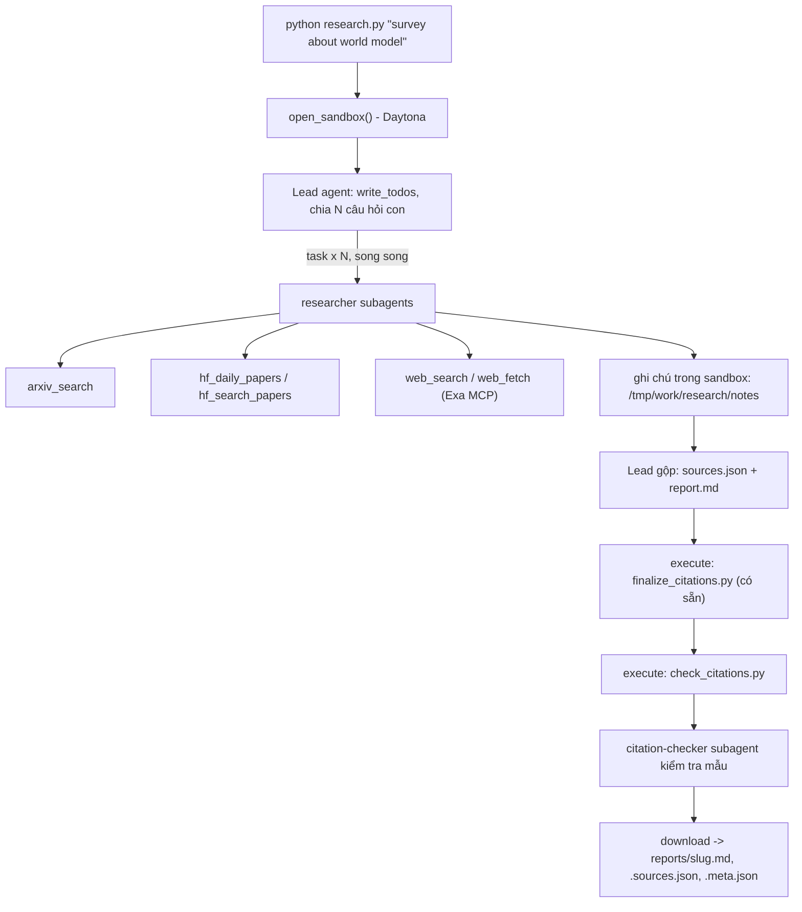

# Deep Research Agent (Deep Agents + Sandbox)

Lab dựng một **hệ thống deep research đa tác tử**: người dùng chỉ cần nhập một chủ đề (ví dụ `survey about world model`), hệ thống tự lập kế hoạch, giao việc cho nhiều subagent, tìm tài liệu trên arXiv, Hugging Face và web, rồi viết một **báo cáo có trích dẫn**.

Hình thức: **bài thực hành cá nhân**. Ngôn ngữ lập trình: Python 3.11 trở lên.

## 1. Mục tiêu học tập

Sau lab, bạn có thể:

1. Dựng agent bằng thư viện Deep Agents (LangChain): công cụ (tool), system prompt, subagent, backend.
2. Dùng **sandbox** (Daytona) làm không gian làm việc và nơi chạy mã cho agent; hiểu vì sao khóa API và công cụ mạng phải nằm ở phía host chứ không nằm trong sandbox.
3. Viết công cụ gọi API ngoài **chịu được giới hạn tốc độ** (retry, backoff, jitter, `Retry-After`).
4. Thiết kế quy trình đa tác tử: lead chia nhỏ câu hỏi, giao cho N researcher chạy song song, tổng hợp và kiểm tra trích dẫn.
5. Tạo báo cáo có thể kiểm chứng: mọi khẳng định có `[n]` trỏ tới một nguồn có thật.

## 2. Hệ thống làm gì



Nguồn dữ liệu:

| Nguồn | Dùng để |
|---|---|
| arXiv API `https://export.arxiv.org/api/query` | Tìm bài theo từ khóa, sắp theo ngày |
| Hugging Face Daily Papers `/api/daily_papers` | Bài đang "trending": upvotes, githubRepo, summary |
| Hugging Face papers search `/api/papers/search?q=` | Tìm bài theo chủ đề |
| Web qua Exa MCP (`web_search_exa`, `web_fetch_exa`) | Blog, survey, trang dự án, nội dung đầy đủ của một URL |

## 3. Cấu trúc thư mục

```
Lab/
├── README.md  GUIDE.md  RUBRIC.md  REPORT_TEMPLATE.md   tài liệu
├── topics.md                 5 chủ đề cần chạy
├── requirements.txt  .env.example  .gitignore
├── model.py                  CÓ SẴN - không sửa: tạo mô hình LLM từ biến môi trường
├── sandbox.py                CÓ SẴN - không sửa: sandbox Daytona (hoặc Docker), upload, download
├── self_check.py             CÓ SẴN - không sửa: tự kiểm tra trước khi nộp (python self_check.py)
├── finalize_citations.py     CÓ SẴN - không sửa: script chạy trong sandbox, tự sinh `## References` và đánh số lại trích dẫn
├── tools.py                  SINH VIÊN CÀI ĐẶT: retry + 5 công cụ nguồn dữ liệu
├── agents.py                 SINH VIÊN CÀI ĐẶT: prompt, subagent, lead agent
├── research.py               SINH VIÊN CÀI ĐẶT: script chính
├── check_citations.py        SINH VIÊN CÀI ĐẶT: kiểm tra trích dẫn, chạy TRONG sandbox
└── reports/                  báo cáo sinh ra (bạn commit vào repo nộp)
```

Mỗi tệp "SINH VIÊN CÀI ĐẶT" là **pseudo-code chạy được** (import được): các hàm có docstring mô tả việc cần làm, các `TODO n` đánh số theo `GUIDE.md`, thân hàm đang `raise NotImplementedError`.

## 4. Cài đặt

```bash
python3 -m venv .venv && source .venv/bin/activate      # Python 3.11+
pip install -r requirements.txt
cp .env.example .env                                     # rồi điền khóa CỦA BẠN
```

Bạn cần ba loại khóa (điền vào `.env`, **không bao giờ commit** `.env`):

| Khóa | Lấy ở đâu | Ghi chú |
|---|---|---|
| LLM (`LAB_MODEL` + khóa nhà cung cấp) | Nhà cung cấp bạn chọn (OpenAI, Anthropic, Google, OpenRouter, Ollama...) | Mô hình **phải hỗ trợ tool calling**. Chép tên mô hình từ tài liệu của nhà cung cấp. |
| `DAYTONA_API_KEY` | https://app.daytona.io | Kiểm tra gói miễn phí / credit hiện hành. Không có tài khoản hoặc hết credit: đặt `SANDBOX=docker` để chạy sandbox trong container Docker cục bộ (xem `.env.example`). |
| `EXA_API_KEY` (khuyến nghị) | https://dashboard.exa.ai/api-keys | Có thể chạy không khóa, nhưng bản miễn phí của MCP bị giới hạn tốc độ rất nhanh. |

## 5. Làm bài

Làm theo thứ tự (chi tiết trong `GUIDE.md`):

1. `check_citations.py`: khởi động nhẹ, thuần Python.
2. `tools.py`: viết `with_retry` và 5 công cụ. Thử riêng từng công cụ: `python tools.py`.
3. `agents.py`: viết prompt, subagent và lead agent.
4. `research.py`: ghép tất cả; chạy một chủ đề:

```bash
python research.py "survey about world model"
```

Kết quả nằm ở `reports/survey-about-world-model.md` cùng `.sources.json` và `.meta.json`.

## 6. Chủ đề và nộp bài

- Chạy đủ **5 chủ đề** trong [`topics.md`](topics.md), mỗi chủ đề một lần.
- Commit mã nguồn và toàn bộ `reports/`, đẩy lên một **public repo** GitHub và nộp link.
- Kiểm tra trước khi nộp: chạy **`python self_check.py`** (không tốn token): nó kiểm tra đủ 5 báo cáo, `meta.json`, trích dẫn bằng `check_citations.py` của bạn, và không có `.env`/khóa nào trong git.
- Cách chấm: xem [`RUBRIC.md`](RUBRIC.md).

## 7. Thời gian, chi phí và an toàn

- Dùng một mô hình **rẻ nhưng hỗ trợ tool calling**, và **đặt giới hạn** (số lần gọi mô hình/công cụ cho lead và subagent, `recursion_limit`): một prompt hỏng có thể khiến agent lặp rất lâu. Đây là hạng mục 2.5 của `RUBRIC.md`.
- Kết quả có tính ngẫu nhiên: cùng một mã có thể cho báo cáo hợp lệ ở lần này và trích dẫn lỗi ở lần sau. Hãy sửa **prompt và mã**, không sửa tay báo cáo.

- Mỗi lần chạy tốn token LLM và thời gian sandbox. `tokens` trong `meta.json` chỉ đếm tin nhắn của lead, chưa gồm subagent, nên chi phí thật cao hơn. `open_sandbox()` luôn dừng và xóa sandbox khi kết thúc, kể cả khi lỗi. Đừng bỏ qua nó.
- **Không đưa bí mật vào sandbox.** Sandbox không ngăn được prompt injection hay việc đẩy dữ liệu ra mạng; một trang web độc hại có thể khiến agent chạy lệnh bên trong sandbox. Vì vậy mọi công cụ gọi mạng và mọi khóa ở lại phía host.
- Nội dung lấy từ web là **dữ liệu không đáng tin**: agent không được làm theo chỉ dẫn nằm trong đó.

## 8. Cấu trúc và cách đọc thư mục `reports/`

Mỗi chủ đề nghiên cứu khi hoàn thành sẽ sinh ra bộ 3 tệp tương ứng trong `reports/`:

1. **`<slug>.md`**: Báo cáo nghiên cứu khoa học tổng hợp bằng tiếng Anh, tuân thủ nghiêm ngặt cấu trúc `REPORT_TEMPLATE.md`:
   - `## TL;DR`: Các phát hiện chính kèm trích dẫn `[n]`.
   - `## Background`: Định nghĩa nền tảng và bối cảnh.
   - Các phần theo chủ đề (`Theme 1 .. k`): So sánh, tổng hợp đa chiều từ các bài báo.
   - `## Trends and open problems`: Xu hướng nghiên cứu 2 năm gần nhất và các bài toán mở.
   - `## References`: Danh sách tài liệu tham khảo được sinh tự động, mỗi dòng trỏ về 1 URL thật.
2. **`<slug>.sources.json`**: Danh mục toàn bộ các bài báo và trang web được trích dẫn trong báo cáo:
   - Định dạng: Mảng JSON gồm `{n, id, url, title, date, source}`.
   - Các họ nguồn (`source`): `arxiv`, `hf-daily`, `hf-search`, `web`.
3. **`<slug>.meta.json`**: Bằng chứng thống kê thực thi phục vụ chấm điểm tự động:
   - `model`: Tên mô hình LLM sử dụng.
   - `elapsed_s`: Thời gian chạy (giây).
   - `subagent_calls`: Số lần Lead Agent giao việc cho Subagent qua công cụ `task` (yêu cầu $\ge 3$).
   - `n_sources`: Tổng số lượng nguồn được trích dẫn trong bài.
   - `source_families`: Danh sách các họ nguồn khác nhau có trong bài (yêu cầu $\ge 3$ họ).
   - `tool_calls` và `tokens`: Thống kê số lượt gọi công cụ và token sử dụng.

### Kết quả nghiệm thu 5 chủ đề:
- Toàn bộ 5 chủ đề trong `topics.md` đều đạt chuẩn $\ge 3$ subagent calls, $\ge 3$ source families và vượt qua 100% kiểm định `check_citations.py` và `self_check.py`.

